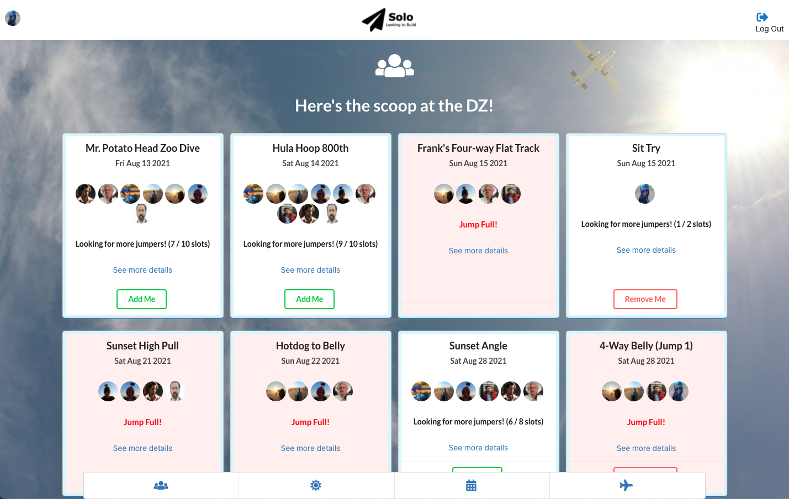
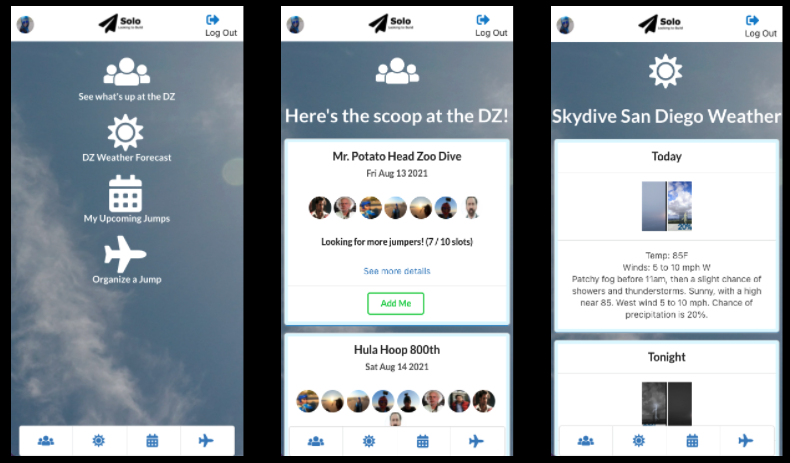

# Solo, Looking to Build 
SoloLTB is a load organizing app built for skydivers using the MERN stack. Once logged in, jumpers can check out upcoming jumps at their home dropzone, join jumps, organize new jumps,check the weather, and look at the profiles of other jumpers. The app also includes an admin portal for easily adding new dropzones and user permissions.

## Screenshots

## Technologies Used
* React
* Semantic UI React
* Express.js
* Node
* HTML/CSS/Javascript
* National Weather Service API
* Mongoose
* MongoDB Atlas

## Getting Started
Check out the app here: [Solo, Looking to Build](https://sololtb.herokuapp.com/)

I used a Trello board to help organize the development of this app, from planning through deployment: [Trello Board - Solo LTB](https://trello.com/b/IjHBTxH9/project-4-solo-ltb)

## Next Steps
* While built for both small and large screens, it still needs a few tweaks for actual phone screens
* Allow users to edit their profile and jumps
* Ability to add disciplines to both jumps and profiles
* Additional user details visible to load organizers
* Additional aviation-specific weather details, such as cloud height, cloud cover, visibility, and winds
* Improve error handling
* Update logo 